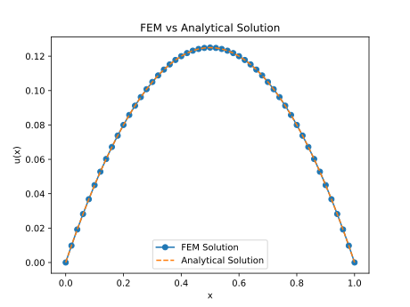

1D Poisson Equation Solver using Finite Element Method (FEM)
============================================================

This repository contains a Python implementation of the Finite Element Method (FEM) to solve the 1D Poisson equation:

$$-\frac{d^2u}{dx^2} = f(x), 0 \leq x \leq L$$

with Dirichlet boundary conditions:

$$u(0) = 0, u(L) = 0$$

In this problem, $f(x) = 1$, and the analytical solution is $u(x) = x(1-x)/2$.

Problem Setup
-------------

The 1D Poisson equation is a second-order differential equation. To solve it using FEM, the process involves the following steps:

### Weak Formulation

To apply FEM, we first need to derive the weak form of the differential equation. We multiply the original differential equation by a test function $v$ (which belongs to the same space as $u$) and integrate over the domain:

$$\int_0^L \left(-\frac{d^2u}{dx^2}\right)v(x) dx = \int_0^L f(x)v(x) dx$$

Using integration by parts and applying the boundary conditions $u(0) = u(L) = 0$, we arrive at the weak form:

$$\int_0^L \frac{du}{dx}\frac{dv}{dx} dx = \int_0^L f(x)v(x) dx$$

This is the weak formulation that is used to construct the FEM system.

### Step 2: Discretization and Shape Functions

The domain $[0, L]$ is divided into $N$ elements, with $N+1$ nodes. We approximate the solution $u(x)$ using linear shape functions $\phi_i(x)$ associated with each node. The solution is expressed as:

$$u(x) \approx \sum_{i=0}^N u_i \phi_i(x)$$

The shape functions $\phi_i(x)$ are piecewise linear and locally supported, meaning each shape function is non-zero only within the two elements connected to node $i$.

### Deriving the Element Stiffness Matrix

For each element $e$, we calculate the local stiffness matrix by substituting the shape functions into the weak form.

Local Weak Form: For element $e$ with nodes $x_e$ and $x_{e+1}$, the local weak form becomes:

$$\int_{x_e}^{x_{e+1}} \frac{du_e}{dx}\frac{dv_e}{dx} dx$$

Approximation using Shape Functions: The solution $u(x)$ is approximated by:

$$u_e(x) = u_e \phi_1(x) + u_{e+1} \phi_2(x)$$

where $\phi_1(x)$ and $\phi_2(x)$ are the shape functions for the element. For linear elements, the shape functions are:

$$\phi_1(x) = \frac{x_{e+1} - x}{h_e}, \phi_2(x) = \frac{x - x_e}{h_e}$$

where $h_e = x_{e+1} - x_e$ is the element length.

Gradient of Shape Functions: The gradients of the shape functions with respect to $x$ are:

$$\frac{d\phi_1}{dx} = -\frac{1}{h_e}, \frac{d\phi_2}{dx} = \frac{1}{h_e}$$

Local Stiffness Matrix: The local stiffness matrix $K_e$ is constructed by evaluating the following integrals:

$$K_e = \frac{1}{h_e} \begin{bmatrix} 1 & -1 \\\ -1 & 1 \end{bmatrix}$$

This is the element stiffness matrix, which is the contribution of each element to the global stiffness matrix.

### Element Load Vector

The local load vector is computed by evaluating:

$$F_e = \int_{x_e}^{x_{e+1}} f(x) \phi(x) dx$$

For simplicity, we assume $f(x) = 1$, which yields a constant source term. The local load vector is:

$$F_e = \frac{h_e}{2} \begin{bmatrix} 1 \\\ 1 \end{bmatrix}$$

### Global System Assembly

The global stiffness matrix $K$ and load vector $F$ are assembled by summing the contributions from all elements. This leads to the global system:

$$Ku = F$$

where $u$ is the vector of unknown of nodal values of $u_i$.
### Applying Boundary Conditions

Dirichlet boundary conditions $u(0) = 0$ and $u(L) = 0$ are applied by modifying the first and last rows of the global stiffness matrix $K$ and load vector $F$.

### Solving the System

Once the system is assembled and boundary conditions are applied, the linear system $Ku = F$ is solved to obtain the nodal values $u_i$.

### Comparing with the Analytical Solution

The analytical solution to the 1D Poisson equation is given by:

$$u(x) = x(1-x)/2$$

The FEM solution is compared with the analytical solution to verify accuracy.